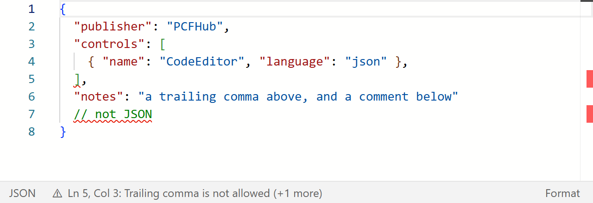

# Code-Editor/PCF

> **The complete documentation is on PCFHub: <https://pcfhub.dev/components/pcf-code-editor>** — installation, configuration for model-driven and canvas apps, the API reference, examples, limitations and a live demo.


## Synopsis

Code Editor PCF implements `Monaco editor` in order to show text area field as a code editor.

## Motivation

`Monaco editor` is a great library and provides a powerful editor out of the box. In Power Apps sometimes We implemented solutions that involve some JSON/XML stored in text area fields. It's difficult to edit the code without the help of an IDE. Code Editor PCF helps with the maintenance and make the edition easy.

## Documentation

#### Contents

* [Installation](#installation)
* [Configuration](#configuration)
* [Notes](#notes)
* [License](#License)

## Installation

### Create a solution file with Power Platform CLI
1. Install the project dependencies
   
    ```bash
    npm install
    ```
    If the console shows the version of npm is not compatible error message, update first the npm version by below command
    ```bash
    npm install -g npm@latest
    ```
2. Build the project
   
    ```bash
    npm run build
    ```

3. Change directory to the CodeEditorSolution folder

    ```bash
    cd CodeEditorSolution
    ```
4. To generate your solution's zip file, use Microsoft Build Engine, or msbuild for short. You'll only need to use the /restore flag the first time the solution project is built. In every subsequent build, you'll need to run msbuild only. The path to your MSBuild.exe can be different depending on the version of Visual Studio you've installed on your machine.
   ```bash
    "C:\Program Files (x86)\Microsoft Visual Studio\2019\Professional\MSBuild\Current\Bin\MSBuild.exe" /t:build /restore
    ```
    For production instance run the follow command:
    ```bash
    "C:\Program Files (x86)\Microsoft Visual Studio\2019\Professional\MSBuild\Current\Bin\MSBuild.exe" /p:configuration=Release
    ```
5. The build should succeed.
6. Locate the CodeEditorSolution folder and expand it.
7. Expand the bin\Debug folder or bin\Release for production.
8. You should see the CodeEditorSolution.zip file here.

The default package type is a Managed solution. If you want to export as Unmanaged (or Both), you can clear (or uncomment) the comment in the following section from your Solutions.cdsproj and edit the SolutionPackageType node accordingly:
```
<!-- Solution Packager overrides un-comment to use: SolutionPackagerType Managed, Unmanaged, Both)-->
        <PropertyGroup>
        <SolutionPackageType>Unmanaged</SolutionPackageType>
        </PropertyGroup>
```

For more information please check the below links:
* [`Connecting to your environment`](https://docs.microsoft.com/en-us/power-apps/developer/component-framework/import-custom-controls#connecting-to-your-environment)
* [`Deploying code components`](https://docs.microsoft.com/en-us/power-apps/developer/component-framework/import-custom-controls#deploying-code-components)
* [`Import components into model-driven apps`](https://docs.microsoft.com/en-us/power-apps/developer/component-framework/import-custom-controls)

## Configuration
Go to the post [`Configure Code Editor PCF`](https://charlesllamas.pro/blog/Configure-Code-Editor-PCF) in order to get the configuration step by step.

The code editor component has a property named `Language` that accepts the
below language modes. Monaco is bundled into the control, so this list is the
whole of it — anything else renders as plain text.

* JSON
* XML
* SQL
* YAML
* Power Query M (`powerquery`)
* DAX (`msdax`)
* Markdown
* PowerShell
* C# (`csharp`)
* Python
* CSS
* HTML
* JavaScript
* TypeScript

Common aliases resolve to the ids above and matching is case-insensitive:
`DAX`, `M`, `Power Query`, `yml`, `T-SQL`, `C#`, `ps1`, `md`, `py`, `js`, `ts`.

Four optional properties arrived in 1.2.0, and a form configured for 1.1.0
upgrades without touching them:

| Property | Values | What it does |
|---|---|---|
| `theme` | `auto` (default), `light`, `dark` | `auto` follows the app's theme where the app publishes one (the modern model-driven look) and is light where it does not (canvas). |
| `height` | pixels | The editor's height where the form allocates none; blank is 500. Ignored where the host sizes the control, as a canvas app does. |
| `fitContent` | on/off | Grow and shrink with the document, up to `height`. |
| `validation` | `on` (default), `off` | Strict JSON and well-formed XML, marked in the editor and named in the strip beneath it. `off` for a column holding JSON with comments. |

The strip under the editor shows the resolved language, the first fault with
its line and column (press it to jump there, hover the underline to read it),
and **Format** for JSON — the same formatter as `Shift+Alt+F` and the
right-click menu.

> **No IntelliSense, and validation for JSON and XML only.** Monaco's language
> services run in web workers, and Power Apps serves a code component as a
> single JavaScript file with no way to serve worker files beside it. The JSON
> and XML checks run on the main thread instead; the other twelve languages
> are coloured, not checked, and no language gets completion. See
> [docs/limitations.md](docs/limitations.md).

#### Notes
`To run MSBuild, you need to have either Visual Studio or the Visual Studio Build Tools installed. You can install the build tools from the Visual Studio Downloads. To access MSBuild, you might need to add it to the path directory of your Windows environment variables. For example, Visual Studio 2022 stores MSBuild at C:\Program Files (x86)\Microsoft Visual Studio\2022\Enterprise\MSBuild\Current\Bin. You can also use the Visual Studio Developer Command Prompt to access MSBuild, or run it by using the full qualified path ("C:\Program Files (x86)\Microsoft Visual Studio\2022\Enterprise\MSBuild\Current\Bin\MSBuild.exe"/t:build /restore).`

## License

[MIT](./LICENSE)
